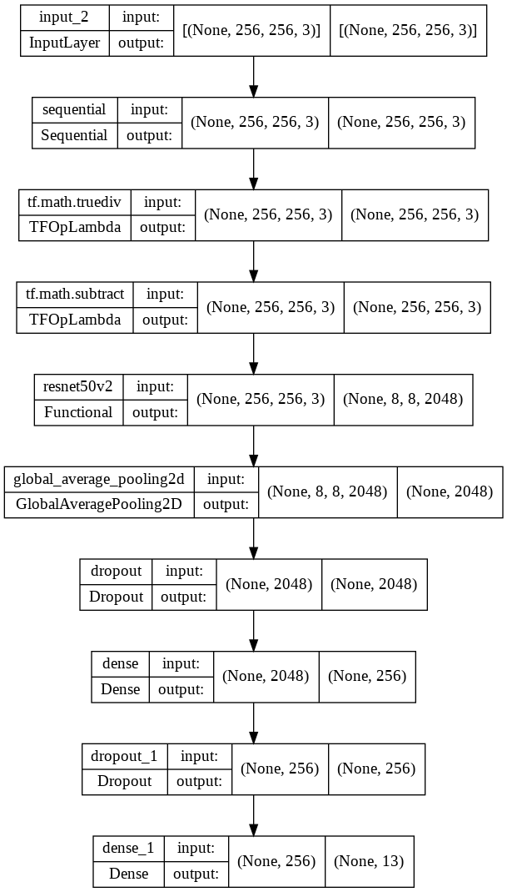
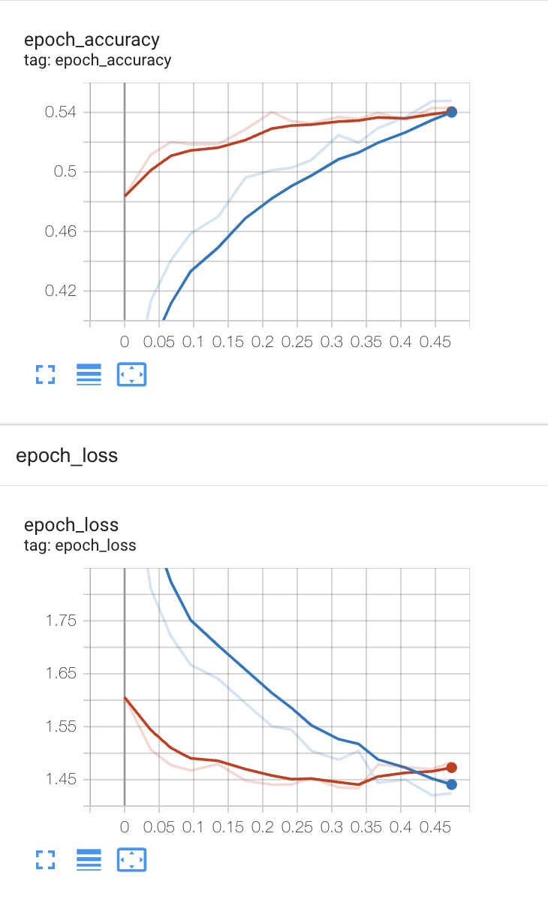
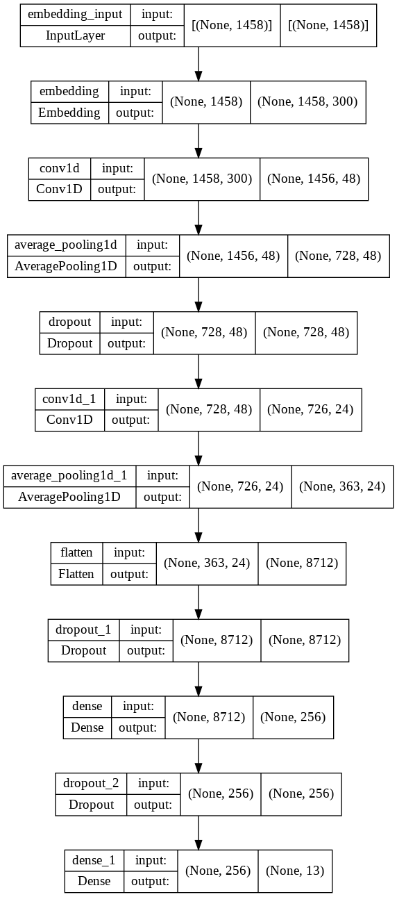
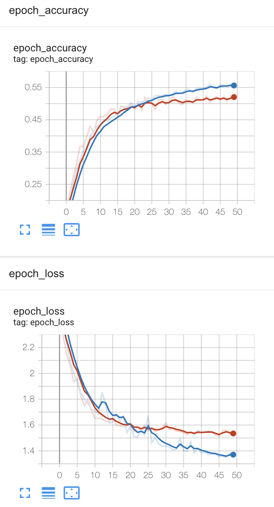
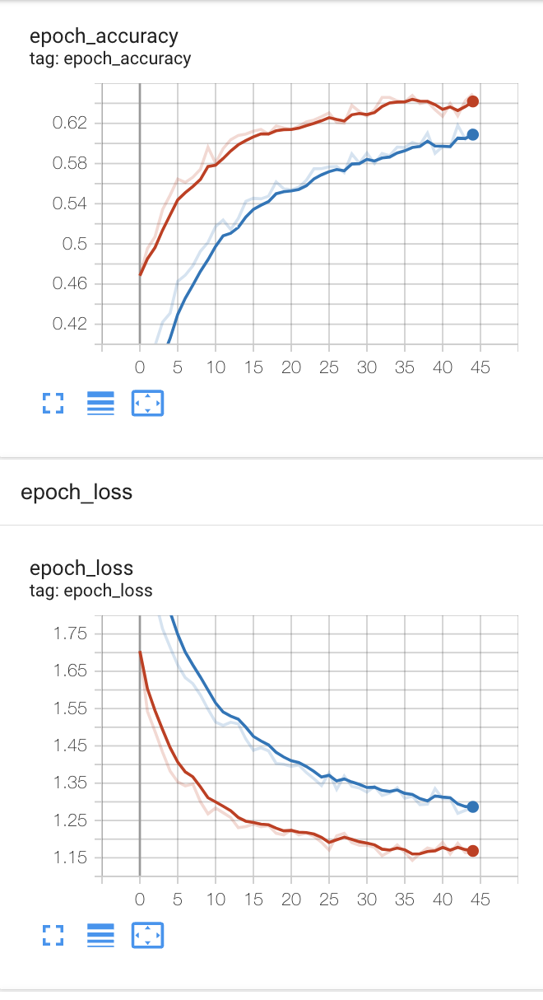

# Facebook MarketPlace Search Ranking

This project aims at recommending buyers to a product by using a multimodal model trained by image and text datasets. Here are a few keynotes about the project: 

- Processed and cleaned text and image datasets
- Designed and trained a multimodal model that combines images and text to generate embedding vectors to create a search index using Tensorflow
- Developed a recommendation system based on the demographic information about potential buyers using the FAISS library from Facebook
- Created a pipeline to systematically clean new data and upsert it into a database
- Containerized the model and orchestrated the containers using Kubernetes
- Monitored and retrain the model using Kubeflow deployed on EKS 

To run the program, simply call:
```python
python main.py
```

Or you can check the result from the [notebook](fb_marketplace_recommendation.ipynb) in this repo. 

This program use environment variables to store credentials, please set the environment according to aws.yaml in your kernel accordingly for database credentials and the image download link of the dataset. 

## Required package
- Python
- Numpy
- Pandas
- sqlalchemy
- psycopg2
- spacy
- pyyaml
- requests
- tqdm
- pillow
- wordcloud
- geopandas
- scikit-learn
- tensorflow
- keras
- tensorboard
- gensim

## Milestone 1

The first step of this project is to import and process the dataset. Two datasets are used in this project:
1. Product dataset
2. Image dataset

The product dataset includes products' information (name, description, price, location...) of the listed products captured from Gumtree. It has 8,091 rows and 9 columns. Images dataset includes the images information for the products. It has 12,604 rows and 5 columns. Both datasets are stored in AWS RDS (Postgres DB) which is maintained by AiCore. 

In addition, the images are zipped and stored in AWS S3. It contains all the image data (in jpg format) is available through HTTPS. 

The second step is to perform feature engineering and data cleaning. It includes generating features from existing features. For example, latitude and longitude are retrieved from the location of each product item, and image width and height for each image. Outliners are also removed in this stage, such as products with an unreasonably high price and images with unexpected width-to-height ratio. 

After feature engineering and data cleaning, the product dataset contains 6,902 rows and 23 columns and the image dataset contains 11,128 rows and 10 columns. 

To have some insights into the dataset, I create some plots showing the distribution of the data such as price distribution, product location ..., more details can be found in the comment of the corresponding class. 

## Milestone 2

The next step is to create simple machine learning models for predicting product price from product data and product type from image data. 

For price prediction, a linear regression model is used. The training and testing process includes:
- Generate features (one hot vector)
- Normalise data
- Split the dataset into training and testing dataset (7:3 train/test)
- Train a model with training dataset 
- Predict the price for testing dataset with the model

We have one-hot encoded the root category, coordinates from location, and tokens count from product name and description from the product dataset as features. After training with the training dataset, the model is tested with the testing dataset. Finally, the performance is then measured by RMSE. 

The RMSE for the model is around 167.6.

For product type prediction, a logistic regression model is used. After merging the product type from product dataset, 10698 images and 12 unique categories were found. 

Having similar steps as the price prediction model, we have one-hot encoded the image mode, flattened image data (10698, 144, 144, 3) -> (10698, 62208), image size (width and height) from the image dataset as features. After training with the training dataset, the model is tested with the testing dataset. Finally, the performance is then measured by accuracy.

The average accuracy for the model is around 0.14

## Milestone 3

We should never satisfy with machine learning models which gives only 14% accuracy. One possible solution is to use deep learning model. For deep leaning mode, it usually requires much more training data than machine learning model to achieve a certain level of performance. However, we only have a dataset with about 12000 images with 13 classes, which means each class has less than 1000 images. Luckily, we can use technique like transfer learning. There exists model that is well-trained with a huge dataset, which has the ability to capture the useful features in the images, and generate embeddings for the final prediction.

To build our CNN model for category prediction, we use RestNet50 as the base model, together with data processing layer, data augmentation layer, global averaging layer, dropout layer, and dense layer and finally prediction layer. The input shape of the image is (256, 256, 3) and the output shape of the model is 13, which equals to the number of unique class in the dataset. 

The model summary is as follows:

    Model: "sequential"
    _________________________________________________________________
     Layer (type)                Output Shape              Param #
    =================================================================
     embedding (Embedding)       (None, 1458, 300)         8397600
    
     conv1d (Conv1D)             (None, 1456, 48)          43248
    
     average_pooling1d (AverageP  (None, 728, 48)          0
     ooling1D)
    
     dropout (Dropout)           (None, 728, 48)           0
    
     conv1d_1 (Conv1D)           (None, 726, 24)           3480
    
     average_pooling1d_1 (Averag  (None, 363, 24)          0
     ePooling1D)
    
     flatten (Flatten)           (None, 8712)              0
    
     dropout_1 (Dropout)         (None, 8712)              0
    
     dense (Dense)               (None, 256)               2230528
    
     dropout_2 (Dropout)         (None, 256)               0
    
     dense_1 (Dense)             (None, 13)                3341
    
    =================================================================
    Total params: 10,678,197
    Trainable params: 2,280,597
    Non-trainable params: 8,397,600



We use the same training, validation and testing dataset as the machine model. The overall accuracy is about 55%, much better than logistic regression.  

The logs of model training will be available in ./logs/image_model/, once the process completed, we can use the following command to upload the result into a Tensorboard.

```commandline
tensorboard dev upload --logdir ./logs/image_model \
  --name "RestNetV50 based CNN image classification model" \
  --description "Training results for CNN models" \
  --one_shot
```

Then we can navigate to link showing on the screen and see the plots of your result.

Here is the result for this model:
https://tensorboard.dev/experiment/Ze8GNeW5T2yhepr8YKgnWA/#scalars&runSelectionState=eyIuIjp0cnVlfQ%3D%3D



## Milestone 4 

The above only can handle image data. In fact, we do have text data like product name and description. This session describes how to build a CNN model for the same classification problem. 

First, we have to transform the text into usable features. To achieve this, we have to clean and process the text data by removing symbols, turning all the text into lowercase and splitting the text into tokens. We then train a Word2Vec embedding model using CBOW algorithm. As Word2Vec training doesn't require any data related to our prediction (category), we can use all of our name and description to train the embedding model. After this, we get a embedding model that can generate a 300 dimension vector for each unique word in the dataset.

Second, we transform the dataset into token index. Since we can get a (number of unique words, 300) a matrix representing the weight for each word from the embedding model. What we can do is to transform each word in the dataset into the token index. Then we can create model that can refer to that weight of the embedding to create word embedding of each word.

Similar to image classification model, we design a CNN model with input shape (1458, 1) and output shape 13, where 1458 is the maximum number of tokens in a record in the dataset, and 13 refers to the number of unique class in the dataset.

The model summary is as follows: 

    Model: "sequential"
    _________________________________________________________________
     Layer (type)                Output Shape              Param #
    =================================================================
     embedding (Embedding)       (None, 1458, 300)         8397600
    
     conv1d (Conv1D)             (None, 1456, 48)          43248
    
     average_pooling1d (AverageP  (None, 728, 48)          0
     ooling1D)
    
     dropout (Dropout)           (None, 728, 48)           0
    
     conv1d_1 (Conv1D)           (None, 726, 24)           3480
    
     average_pooling1d_1 (Averag  (None, 363, 24)          0
     ePooling1D)
    
     flatten (Flatten)           (None, 8712)              0
    
     dropout_1 (Dropout)         (None, 8712)              0
    
     dense (Dense)               (None, 256)               2230528
    
     dropout_2 (Dropout)         (None, 256)               0
    
     dense_1 (Dense)             (None, 13)                3341
    
    =================================================================
    Total params: 10,678,197
    Trainable params: 2,280,597
    Non-trainable params: 8,397,600



We use the same training, validation and testing dataset as the machine model. The overall accuracy is about 51%, again, much better than machine learning classification model.  

The logs of model training will be available in ./logs/text_model/, once the process completed, we can use the following command to upload the result into a Tensorboard.

```commandline
tensorboard dev upload --logdir ./logs/text_model \
  --name "CNN text classification model" \
  --description "Training results for CNN models" \
  --one_shot
```

Then we can navigate to link showing on the screen and see the plots of your result.

Here is the result for this model:
https://tensorboard.dev/experiment/9u1q6KkzTzaJm5I6fVwO7Q/#scalars



## Milestone 5 

In previous milestones, we demonstrate how to input image and text into the models to perform classification. In fact, we can combine them into a single model.

Since there is no single method from Tensorflow/Keras can allow user generates dataset with text and images at the same time, it adds challenges building the dataset as well as the model. In this project, I use dataset generator to create a dataset, which can output a batch of text and image records at a time. 

Also, as the model complexity increases, I create a separate class for the actual CNN model (inherent the tf.keras.Model) for better readability.

The mode summary is as follows:

    _________________________________________________________________
     Layer (type)                Output Shape              Param #   
    =================================================================
     embedding (Embedding)       multiple                  8397600   
                                                                     
     conv1d (Conv1D)             multiple                  43248     
                                                                     
     average_pooling1d (AverageP  multiple                 0         
     ooling1D)                                                       
                                                                     
     dropout (Dropout)           multiple                  0         
                                                                     
     conv1d_1 (Conv1D)           multiple                  3480      
                                                                     
     average_pooling1d_1 (Averag  multiple                 0         
     ePooling1D)                                                     
                                                                     
     flatten (Flatten)           multiple                  0         
                                                                     
     dropout_1 (Dropout)         multiple                  0         
                                                                     
     dense (Dense)               multiple                  1115264   
                                                                     
     dropout_2 (Dropout)         multiple                  0         
                                                                     
     sequential (Sequential)     (32, 256, 256, 3)         0         
                                                                     
     resnet50v2 (Functional)     (None, 8, 8, 2048)        23564800  
                                                                     
     global_average_pooling2d (G  multiple                 0         
     lobalAveragePooling2D)                                          
                                                                     
     dropout_3 (Dropout)         multiple                  0         
                                                                     
     dense_1 (Dense)             multiple                  262272    
                                                                     
     dropout_4 (Dropout)         multiple                  0         
                                                                     
     dense_2 (Dense)             multiple                  3341      
                                                                     
    =================================================================
    Total params: 33,390,005
    Trainable params: 1,427,605
    Non-trainable params: 31,962,400
    _________________________________________________________________


We use the same training, validation and testing dataset as the machine model. The overall accuracy is about 51%, again, much better than machine learning classification model.  

The logs of model training will be available in ./logs/image_text_model/, once the process completed, we can use the following command to upload the result into a Tensorboard.

```commandline
tensorboard dev upload --logdir ./logs/image_text_model \
  --name "Combined CNN classification model" \
  --description "Training results for CNN models" \
  --one_shot
```

Then we can navigate to link showing on the screen and see the plots of your result.

Here is the result for this model:
https://tensorboard.dev/experiment/sBwpognaSqa3Q55UN5G4Yg/#scalars





## TODO:
- **[Issue]** Model graph not showing the model structure for combined model.
- **[Milestone 6]** Setup Kubeflow.
- **[Milestone 7]** Deploy the model into Kubeflow.
- **[Enhancement][ML]** Enhance machine learning models, use grid search and hyperparameters tuning.
- **[Enhancement][Image Model]** Use other based line model as our transfer learning part, compare the performance.
- **[Enhancement][Text Model]** Use pre-trained transformer based word embedding model instead of Word2Vec, compare the performance.
- **[Enhancement][Text Model]** Use RNN (LSTM/GRU) or Transformer layer instead of CNN for text model, compare the performance.
- **[Learning]** Create API for prediction.
- **[Learning]** Pytorch everything.
- **[Learning]** Price prediction.

## Reference

Deep Residual Learning for Image Recognition (CVPR 2015) (https://arxiv.org/abs/1512.03385)
