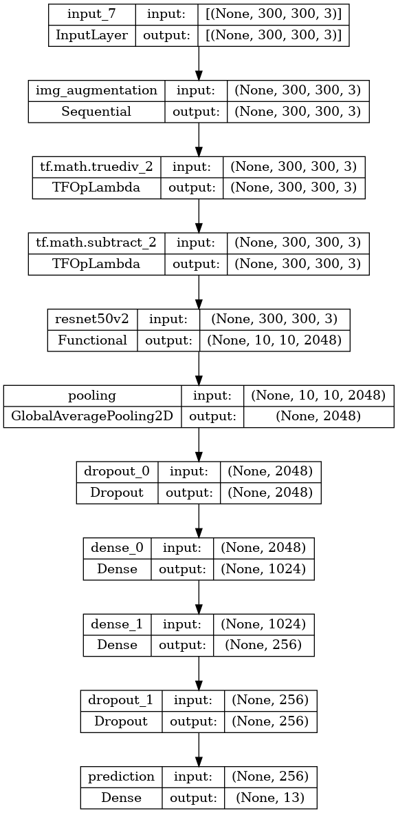
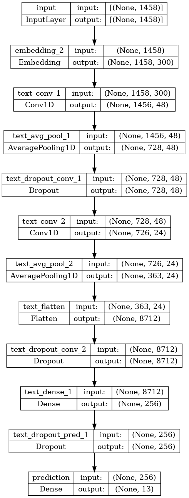
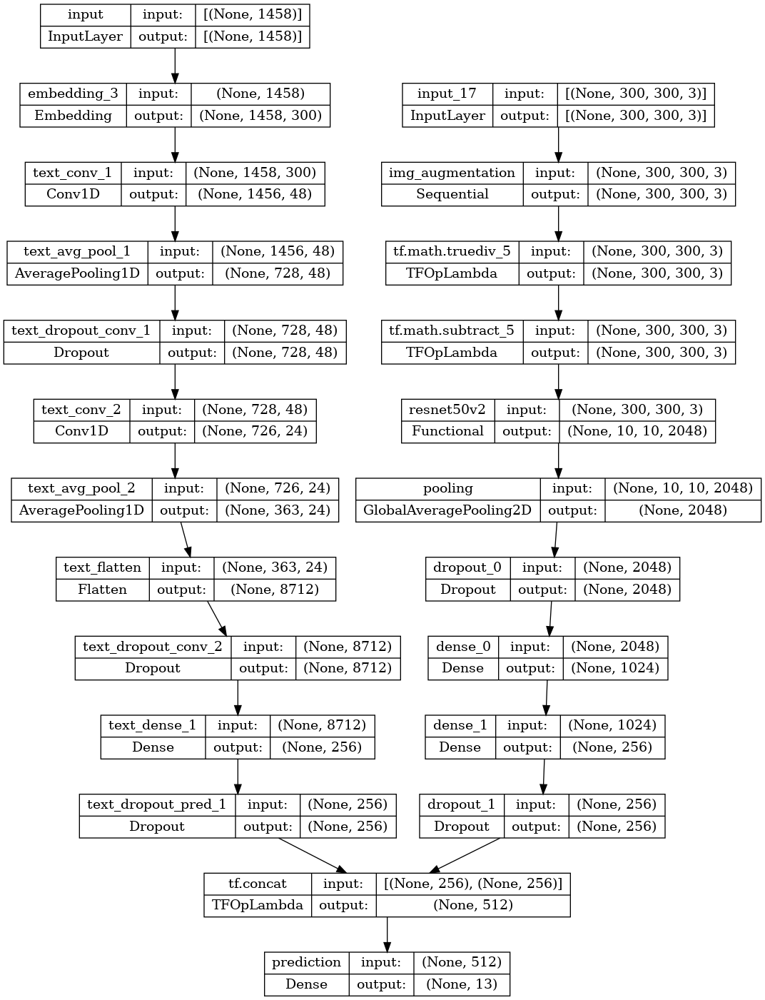

# Facebook MarketPlace Search Ranking

## Project Description
This project aims at recommending buyers to a product by using a multimodal model trained by image and text datasets. Here are a few keynotes about the project: 

- Processed and cleaned text and image datasets
- Designed and trained a multimodal model that combines images and text to generate embedding vectors to create a search index using Tensorflow
- Developed a recommendation system based on the demographic information about potential buyers using the FAISS library from Facebook
- Created a pipeline to systematically clean new data and upsert it into a database
- Containerized the model and orchestrated the containers using Kubernetes
- Monitored and retrain the model using Kubeflow deployed on EKS

## Installation
Simply install requirement_pt.txt (PyTorch) or requirement_tf.txt (Tensorflow) using 
```
pip install -r <path to reqirement file>
```

If you are using M1, see the instructions on /install/README_m1.md. 

At the time being, some modules haven't been fully supported running on mps (GPU of M1) device yet. For instance, torchvision.transform and EfficientNet model.
So running on device with CUDA GPU or cloud services like Google Colab or Paperspace is suggested. 

To run the program, simply call:
```python
python main.py
```

This will run Tensorflow version of all models described below.

Or you can check the result from the [notebook](fb_marketplace_recommendation.ipynb) in this repo. 

This program use environment variables to store credentials, please set the environment according to aws.yaml in your kernel accordingly for database credentials and the image download link of the dataset.

## Milestone 1

The first step of this project is to import and process the dataset. Two datasets are used in this project:
1. Product dataset
2. Image dataset

The product dataset includes products' information (name, description, price, location...) of the listed products captured from Gumtree. It has 8,091 rows and 9 columns. Images dataset includes the images information for the products. It has 12,604 rows and 5 columns. Both datasets are stored in AWS RDS (Postgres DB) which is maintained by AiCore. 

In addition, the images are zipped and stored in AWS S3. It contains all the image data (in jpg format) is available through HTTPS. 

The second step is to perform feature engineering and data cleaning. It includes generating features from existing features. For example, latitude and longitude are retrieved from the location of each product item, and image width and height for each image. Outliners are also removed in this stage, such as products with an unreasonably high price and images with unexpected width-to-height ratio. 

After feature engineering and data cleaning, the product dataset contains 6,902 rows and 23 columns and the image dataset contains 11,128 rows and 10 columns. 

To have some insights into the dataset, some plots are created for showing the distribution of the data such as price distribution, product location ..., more details can be found in the comment of the corresponding class.

## Milestone 2

The next step is to create simple machine learning models for predicting product price from product data and product type from image data. 

For price prediction, a linear regression model is used. The training and testing process includes:
- Generate features (one hot vector)
- Normalise data
- Split the dataset into training and testing dataset (7:3 train/test)
- Train a model with training dataset 
- Predict the price for testing dataset with the model

We have one-hot encoded the root category, coordinates from location, and tokens count from product name and description from the product dataset as features. After training with the training dataset, the model is tested with the testing dataset. Finally, the performance is then measured by RMSE. 

The RMSE for the model is around 167.6.

For product type prediction, a logistic regression model is used. After merging the product type from product dataset, 10698 images and 12 unique categories were found. 

Having similar steps as the price prediction model, we have one-hot encoded the image mode, flattened image data (10698, 144, 144, 3) -> (10698, 62208), image size (width and height) from the image dataset as features. After training with the training dataset, the model is tested with the testing dataset. Finally, the performance is then measured by accuracy.

The average accuracy for the model is around 0.14

## Milestone 3

We should never satisfy with machine learning models which gives only 14% accuracy. One possible solution is to use deep learning model. For deep leaning mode, it usually requires much more training data than machine learning model to achieve a certain level of performance. However, we only have a dataset with about 12000 images with 13 classes, which means each class has less than 1000 images. Luckily, we can use technique like transfer learning. There exists model that is well-trained with a huge dataset, which has the ability to capture the useful features in the images, and generate embeddings for the final prediction.

To build our image classification model, we use RestNet50 and EfficientNet as the base model, which both are pretained with ImageNet dataset, together with data transformation layer, global pooling layer, dropout layer, and linear layer with ReLu activation and finally prediction layer. 

In detail:
- Data transformation layer randomly rotates and flip the images to increase the versatility of the model, making sure the model can take images with different angles, and performs normalisation to make sure all the values are between [0, 1] (or [-1, 1] depending on the based model. Since the image based model are pretrained with ImageNet dataset, we use the same mean (0.485, 0.456, 0.406) and and standard deviation (0.229, 0.224, 0.225) for normalisation as suggested for the dataset.
- Average pooling layer gathers the features from different dimensions (width, height and channel).
- Dropout layer avoids the model to be overfitted by randomly drop out the weight of some hidden layers.
- Linear layer reduce the number of hidden layers with activation function ReLU to non-linearly transform the value in each hidden layers, which will be the embedding for our combined model.
- Final prediction layer, which is also a linear layer without any activation function, gives us the tensor with the same size of number of categories, then we can use softmax to calculate the probability for each class and find out the predicted category.

The input shape of the image is (300, 300, 3) and the output shape of the model is 13, which equals to the number of unique class in the dataset.

### Optimizer, scheduler and early stopping
The optimiser is AdamW, initialised with a polynomial decay scheduler with initial learning rate. We can benefit from using this optimiser by having an adjusted learning rate for each parameter, training quickly in the first few epochs but getting slowly later, to improve the model performance. A warmup is also applied to the first 10% of the training dataset of the epoch, to let the optimiser get used to the data before actually adjust the weights of the model.
Early stopping is also being applied to avoid the model being over-trained and hence avoid overfitting. Also, if the early stopping is triggered, the model's weights from the lowest loss epoch will be restored to make sure we have the best weights of the model.

### Training and fine-tuning
The model training includes two stages, training and fine-tuning. We will use this approach for training our text and combine models as well. 

**Training**

The image based model is freezed in the first 12 (8 for EfficientNet) epochs, this allows us to train the layers other than the based model in a higher learning rate. The initial learning rate is 0.001 and early stopping is 5, which means it stop training after the loss doesn't decrease for 5 epochs.  

**Fine-tuning**

The image based model is unfreeze and the whole model is trained for another 8 epochs with lower learning rate 0.00001. Since the image based model is pre-trained with a much larger dataset, and also other layers are trained in the training stage, what we need is to fine-tune all the layers to make sure their weights are trained with our dataset but not being overfitted to the training data. This is one technique using the pre-trained model for transfer learning, we are training the models with our dataset but not over doing it as the weights of the based model are well-trained for capturing features from a larger dataset. The early stopping is also 5 in the fine-tuning stage. 

The model summary is as follows:

**RestNet50**

[](readme_images/tf_image_model_RestNet50.png)

    Model: "tf_image_model_RestNet50"
    ____________________________________________________________________________
     Layer (type)                Output Shape              Param #   Trainable  
    ============================================================================
     input_1 (InputLayer)        [(None, 300, 300, 3)]     0         Y          
                                                                                
     img_augmentation (Sequentia  (None, 300, 300, 3)      0         Y          
     l)                                                                         
    |¯¯¯¯¯¯¯¯¯¯¯¯¯¯¯¯¯¯¯¯¯¯¯¯¯¯¯¯¯¯¯¯¯¯¯¯¯¯¯¯¯¯¯¯¯¯¯¯¯¯¯¯¯¯¯¯¯¯¯¯¯¯¯¯¯¯¯¯¯¯¯¯¯¯|
    | random_flip (RandomFlip)  (None, 300, 300, 3)       0         Y          |
    |                                                                          |
    | random_rotation (RandomRota  (None, 300, 300, 3)    0         Y          |
    | tion)                                                                    |
    ¯¯¯¯¯¯¯¯¯¯¯¯¯¯¯¯¯¯¯¯¯¯¯¯¯¯¯¯¯¯¯¯¯¯¯¯¯¯¯¯¯¯¯¯¯¯¯¯¯¯¯¯¯¯¯¯¯¯¯¯¯¯¯¯¯¯¯¯¯¯¯¯¯¯¯¯
     tf.math.truediv (TFOpLambda  (None, 300, 300, 3)      0         Y          
     )                                                                          
                                                                                
     tf.math.subtract (TFOpLambd  (None, 300, 300, 3)      0         Y          
     a)                                                                         
                                                                                
     image_sequential (Sequentia  (None, 256)              25925376  Y          
     l)                                                                         
    |¯¯¯¯¯¯¯¯¯¯¯¯¯¯¯¯¯¯¯¯¯¯¯¯¯¯¯¯¯¯¯¯¯¯¯¯¯¯¯¯¯¯¯¯¯¯¯¯¯¯¯¯¯¯¯¯¯¯¯¯¯¯¯¯¯¯¯¯¯¯¯¯¯¯|
    | resnet50v2 (Functional)   (None, 10, 10, 2048)      23564800  Y          |
    |                                                                          |
    | pooling (GlobalAveragePooli  (None, 2048)           0         Y          |
    | ng2D)                                                                    |
    |                                                                          |
    | dropout_0 (Dropout)       (None, 2048)              0         Y          |
    |                                                                          |
    | dense_0 (Dense)           (None, 1024)              2098176   Y          |
    |                                                                          |
    | dense_1 (Dense)           (None, 256)               262400    Y          |
    |                                                                          |
    | dropout_1 (Dropout)       (None, 256)               0         Y          |
    ¯¯¯¯¯¯¯¯¯¯¯¯¯¯¯¯¯¯¯¯¯¯¯¯¯¯¯¯¯¯¯¯¯¯¯¯¯¯¯¯¯¯¯¯¯¯¯¯¯¯¯¯¯¯¯¯¯¯¯¯¯¯¯¯¯¯¯¯¯¯¯¯¯¯¯¯
     prediction (Dense)          (None, 13)                3341      Y          
                                                                                
    ============================================================================
    Total params: 25,928,717
    Trainable params: 25,837,837
    Non-trainable params: 90,880
    ______________________________


**EfficientNetB3**

[](readme_images/tf_image_model_EfficientNetB3.png)

    Model: "tf_image_model_EfficientNetB3"
    ____________________________________________________________________________
     Layer (type)                Output Shape              Param #   Trainable  
    ============================================================================
     input_1 (InputLayer)        [(None, 300, 300, 3)]     0         Y          
                                                                                
     img_augmentation (Sequentia  (None, 300, 300, 3)      0         Y          
     l)                                                                         
    |¯¯¯¯¯¯¯¯¯¯¯¯¯¯¯¯¯¯¯¯¯¯¯¯¯¯¯¯¯¯¯¯¯¯¯¯¯¯¯¯¯¯¯¯¯¯¯¯¯¯¯¯¯¯¯¯¯¯¯¯¯¯¯¯¯¯¯¯¯¯¯¯¯¯|
    | random_flip (RandomFlip)  (None, 300, 300, 3)       0         Y          |
    |                                                                          |
    | random_rotation (RandomRota  (None, 300, 300, 3)    0         Y          |
    | tion)                                                                    |
    ¯¯¯¯¯¯¯¯¯¯¯¯¯¯¯¯¯¯¯¯¯¯¯¯¯¯¯¯¯¯¯¯¯¯¯¯¯¯¯¯¯¯¯¯¯¯¯¯¯¯¯¯¯¯¯¯¯¯¯¯¯¯¯¯¯¯¯¯¯¯¯¯¯¯¯¯
     image_sequential (Sequentia  (None, 256)              14766910  Y          
     l)                                                                         
    |¯¯¯¯¯¯¯¯¯¯¯¯¯¯¯¯¯¯¯¯¯¯¯¯¯¯¯¯¯¯¯¯¯¯¯¯¯¯¯¯¯¯¯¯¯¯¯¯¯¯¯¯¯¯¯¯¯¯¯¯¯¯¯¯¯¯¯¯¯¯¯¯¯¯|
    | efficientnetv2-b3 (Function  (None, 10, 10, 1536)   12930622  Y          |
    | al)                                                                      |
    | pooling (GlobalAveragePooli  (None, 1536)           0         Y          |
    | ng2D)                                                                    |
    |                                                                          |
    | dropout_0 (Dropout)       (None, 1536)              0         Y          |
    |                                                                          |
    | dense_0 (Dense)           (None, 1024)              1573888   Y          |
    |                                                                          |
    | dense_1 (Dense)           (None, 256)               262400    Y          |
    |                                                                          |
    | dropout_1 (Dropout)       (None, 256)               0         Y          |
    ¯¯¯¯¯¯¯¯¯¯¯¯¯¯¯¯¯¯¯¯¯¯¯¯¯¯¯¯¯¯¯¯¯¯¯¯¯¯¯¯¯¯¯¯¯¯¯¯¯¯¯¯¯¯¯¯¯¯¯¯¯¯¯¯¯¯¯¯¯¯¯¯¯¯¯¯
     prediction (Dense)          (None, 13)                3341      Y          
                                                                                
    ============================================================================
    Total params: 14,770,251
    Trainable params: 14,551,819
    Non-trainable params: 218,432


The same training, validation and testing datasets are used as the machine learning model.     

The accuracies for testing dataset are 0.59 (RestNet50) and 0.64 (EfficientNetB3), much better than logistic regression.  

The logs of model training will be available in the log_path attribute of the classifier, once the process completed, we can use the following command to upload the result into a Tensorboard.

```commandline
tensorboard dev upload --logdir ./logs/<log_path of the model> \
  --name <model name> \
  --description <description> \
  --one_shot
```

The same command is used for uploading logs in the Tensorboard for other models

Then we can navigate to link showing on the screen and see the plots of your result.

Here is the result for this model:

RestNet50: 

[](readme_images/tf_restnet50_metrics.png)

https://tensorboard.dev/experiment/HwNtV7ojTdmgOP4hjC0gxQ/

EfficientNet: 

[](readme_images/tf_efficientnet_metrics.png)

https://tensorboard.dev/experiment/Yq24bbyPQNaKcQb4dVBYvA/

## Milestone 4

The above only can handle image data. In fact, we do have text data like product name and description. This session describes how to build a CNN model for the same classification problem. Since no machine learning and deep learning model can accept text as input, we need to encode the text into numeric features. This is called word embedding. In this session, we use two approaches: Word2Vec and BERT.    

### Word2Vec

In this session, we train our Word2Vec model from our dataset. Before training, we have to clean and process the text data by removing symbols, turning all the text into lowercase and splitting the text into tokens. We then train a Word2Vec embedding model using CBOW algorithm. As Word2Vec training doesn't require any data related to our prediction (category), we can use all of our name and description to train the embedding model. After this, we get a embedding model that can generate a 300 dimension vector for each unique word in the dataset.

Second, we transform the dataset into token index. Since we can get a (number of unique words, 300) a matrix representing the weight for each word from the embedding model. What we can do is to transform each word in the dataset into the token index. Then we can create model that can refer to that weight of the embedding to create word embedding of each word.

Similar to image classification model, we design a CNN model with input shape (1458, 1) and output shape 13, where 1458 is the maximum number of tokens in a record in the dataset, and 13 refers to the number of unique class in the dataset.

It consists convolution layers, average pooling layers, a flatten layer, dropout layers, a linear layer with ReLU activation function and a linear layer as a prediction layer.
- Convolution layers and average pooling layers are used to capture features between the text embedding. 
- Flatten is used to reduce the data dimension to make it 1D tensor. 
- Dropout layer avoids the model to be overfitted by randomly drop out the weight of some hidden layers.
- Linear layer reduce the number of hidden layers with activation function ReLU to non-linearly transform the value in each hidden layers, which will be the embedding for our combined model.
- Final prediction layer, which is also a linear layer without any activation function, gives us the tensor with the same size of number of categories, then we can use softmax to calculate the probability for each class and find out the predicted category.

[](readme_images/tf_text_model_Word2Vec.png)

The model summary is as follows:

    Model: "sequential"
    _________________________________________________________________
     Layer (type)                Output Shape              Param #
    =================================================================
     embedding (Embedding)       (None, 1458, 300)         8397600
    
     conv1d (Conv1D)             (None, 1456, 48)          43248
    
     average_pooling1d (AverageP  (None, 728, 48)          0
     ooling1D)
    
     dropout (Dropout)           (None, 728, 48)           0
    
     conv1d_1 (Conv1D)           (None, 726, 24)           3480
    
     average_pooling1d_1 (Averag  (None, 363, 24)          0
     ePooling1D)
    
     flatten (Flatten)           (None, 8712)              0
    
     dropout_1 (Dropout)         (None, 8712)              0
    
     dense (Dense)               (None, 256)               2230528
    
     dropout_2 (Dropout)         (None, 256)               0
    
     dense_1 (Dense)             (None, 13)                3341
    
    =================================================================
    Total params: 10,678,197
    Trainable params: 2,280,597
    Non-trainable params: 8,397,600


### Training and fine-tuning

**Training** 

The Word2Vec embedding layer is freezed in the first 20 epochs, this allows us to train the layers other than the based model in a higher learning rate. The initial learning rate is 0.001 and early stopping is 5, which means it stop training after the loss doesn't decrease for 5 epochs.  

**Fine-tuning**

The Word2Vec embedding layer is unfreeze and the whole model is trained for another 15 epochs with lower learning rate 0.0005 and 5 rounds early stopping. But unlike to image model, we don't restore the weight when early stopping is trigger. The reason is from the experiment, the validation accuracy kept increasing even the validation loss was increasing in last few epochs. This may happen there are some outliner records that the model can't recognise, but the model actually improve on other normal records.  

We use the same training, validation and testing dataset as the machine model. The overall accuracy is about 73%, again, much better than machine learning classification model.

Here is the result for this model:

[](readme_images/tf_word2vec_metrics.png)

https://tensorboard.dev/experiment/LdNgKC7CQBKhdWgLa1WhYA/

### BERT
Apart from Word2Vec, we can also use transformer based word embedding model to encode the text, which is proved to be a better model to capture features from text in many situations. Again, as there are lots of pre-trained models available, we can do transfer learning again to build our model. The pre-trained model we choose is BERT based cased model. The pre-trained model comes with the tokenizer which can convert the text into token indices and attention mask.
The pre-trained model usually being trained with some tasks like text classification. While the output from the last hidden layer can be represented as the word embedding, we can also use the "pooler output" which contains the embedding for the whole sentence or even a paragraph. As mentioned, this output is generated for the pre-trained task so it should consist the features captured from the text.
In our model, we use this pooler output generated from the embedding model as the text embedding.

Our model consists of an embedding layer, a linear layer with ReLU activation function, a dropout layer and a final linear layer as the prediction layer.
- Embedding layer convert tokens into word embedding and sentence embedding
- Dropout layer avoids the model to be overfitted by randomly drop out the weight of some hidden layers.
- Linear layer reduce the number of hidden layers with activation function ReLU to non-linearly transform the value in each hidden layers, which will be the embedding for our combined model.
- Final prediction layer, which is also a linear layer without any activation function, gives us the tensor with the same size of number of categories, then we can use softmax to calculate the probability for each class and find out the predicted category.

[](readme_images/tf_text_model_BERT.png)

The model summary is as follows: 

    Model: "tf_text_model_BERT"
    ____________________________________________________________________________
     Layer (type)                Output Shape              Param #   Trainable  
    ============================================================================
     input (InputLayer)          [(None,)]                 0         Y          
                                                                                
     text_seq_layer_transformer   (None, 256)              10850713  Y          
     (Functional)                                          7                    
    |¯¯¯¯¯¯¯¯¯¯¯¯¯¯¯¯¯¯¯¯¯¯¯¯¯¯¯¯¯¯¯¯¯¯¯¯¯¯¯¯¯¯¯¯¯¯¯¯¯¯¯¯¯¯¯¯¯¯¯¯¯¯¯¯¯¯¯¯¯¯¯¯¯¯|
    | input (InputLayer)        [(None,)]                 0         Y          |
    |                                                                          |
    | keras_layer (KerasLayer)  {'input_mask': (None, 12  0         N          |
    |                           8),                                            |
    |                            'input_word_ids': (None                       |
    |                           , 128),                                        |
    |                            'input_type_ids': (None                       |
    |                           , 128)}                                        |
    |                                                                          |
    | keras_layer_1 (KerasLayer)  {'sequence_output': (Non  10831027  Y        |
    |                           e, 128, 768),             3                    |
    |                            'default': (None, 768),                       |
    |                            'encoder_outputs': [(No                       |
    |                           ne, 128, 768),                                 |
    |                            (None, 128, 768),                             |
    |                            (None, 128, 768),                             |
    |                            (None, 128, 768),                             |
    |                            (None, 128, 768),                             |
    |                            (None, 128, 768),                             |
    |                            (None, 128, 768),                             |
    |                            (None, 128, 768),                             |
    |                            (None, 128, 768),                             |
    |                            (None, 128, 768),                             |
    |                            (None, 128, 768),                             |
    |                            (None, 128, 768)],                            |
    |                            'pooled_output': (None,                       |
    |                            768)}                                         |
    |                                                                          |
    | dropout (Dropout)         (None, 768)               0         Y          |
    |                                                                          |
    | dense_1 (Dense)           (None, 256)               196864    Y          |
    ¯¯¯¯¯¯¯¯¯¯¯¯¯¯¯¯¯¯¯¯¯¯¯¯¯¯¯¯¯¯¯¯¯¯¯¯¯¯¯¯¯¯¯¯¯¯¯¯¯¯¯¯¯¯¯¯¯¯¯¯¯¯¯¯¯¯¯¯¯¯¯¯¯¯¯¯
     prediction (Dense)          (None, 13)                3341      Y          
                                                                                
    ============================================================================
    Total params: 108,510,478
    Trainable params: 108,510,477
    Non-trainable params: 1


### Training and fine-tuning

**Fine-tuning**

Since we don't have many layers to train except from the embedding model. We perform fine-tuning only for this model. 
The BERT embedding layer is unfreeze and the whole model is trained for 5 epochs with a very low learning rate 0.00002 and 2 rounds early stopping.

The model stopped training after 4 epochs, since the validation loss hadn't improved for 2 epochs.   

We use the same training, validation and testing dataset as the machine model. The overall accuracy is about 79%, again, much better than machine learning classification model.

Here is the result for this model:

[](readme_images/tf_BERT_metrics.png)

https://tensorboard.dev/experiment/W1fq94q0ROynXpbCmxK46Q/
 

## Milestone 5 

In previous milestones, we demonstrate how to input image and text into the models to perform classification. In fact, we can combine them into a single model.

**RestNet50 + Word2Vec**

This model simply extracts the layers from the RestNet50 image classification model and Word2Vec text classification model except the final prediction layer, concatenates the output of the last hidden layer of both models and finally train a prediction layer for the classification task.

[](readme_images/tf_image_text_model_RestNet50_Word2Vec.png)

The left side of the graph is the image processing layers while the right side is the text processing layers, which are both following the same architecture as the previous models. 

The mode summary is as follows:

    Model: "tf_image_text_model_RestNet50_Word2Vec"
    _____________________________________________________________________________________________________________
     Layer (type)                   Output Shape         Param #     Connected to                     Trainable  
    =============================================================================================================
     input_3 (InputLayer)           [(None, 300, 300, 3  0           []                               Y          
                                    )]                                                                           
                                                                                                                 
     img_augmentation (Sequential)  (None, 300, 300, 3)  0           ['input_3[0][0]']                Y          
    |¯¯¯¯¯¯¯¯¯¯¯¯¯¯¯¯¯¯¯¯¯¯¯¯¯¯¯¯¯¯¯¯¯¯¯¯¯¯¯¯¯¯¯¯¯¯¯¯¯¯¯¯¯¯¯¯¯¯¯¯¯¯¯¯¯¯¯¯¯¯¯¯¯¯¯¯¯¯¯¯¯¯¯¯¯¯¯¯¯¯¯¯¯¯¯¯¯¯¯¯¯¯¯¯¯¯¯|
    | random_flip_1 (RandomFlip)   (None, 300, 300, 3)  0           []                               Y          |
    |                                                                                                           |
    | random_rotation_1 (RandomRotat  (None, 300, 300, 3)  0        []                               Y          |
    | ion)                                                                                                      |
    ¯¯¯¯¯¯¯¯¯¯¯¯¯¯¯¯¯¯¯¯¯¯¯¯¯¯¯¯¯¯¯¯¯¯¯¯¯¯¯¯¯¯¯¯¯¯¯¯¯¯¯¯¯¯¯¯¯¯¯¯¯¯¯¯¯¯¯¯¯¯¯¯¯¯¯¯¯¯¯¯¯¯¯¯¯¯¯¯¯¯¯¯¯¯¯¯¯¯¯¯¯¯¯¯¯¯¯¯¯
     tf.math.truediv_1 (TFOpLambda)  (None, 300, 300, 3)  0          ['img_augmentation[0][0]']       Y          
                                                                                                                 
     input (InputLayer)             [(None, 1458)]       0           []                               Y          
                                                                                                                 
     tf.math.subtract_1 (TFOpLambda  (None, 300, 300, 3)  0          ['tf.math.truediv_1[0][0]']      Y          
     )                                                                                                           
                                                                                                                 
     text_seq_layers (Sequential)   (None, 256)          10674856    ['input[0][0]']                  N          
    |¯¯¯¯¯¯¯¯¯¯¯¯¯¯¯¯¯¯¯¯¯¯¯¯¯¯¯¯¯¯¯¯¯¯¯¯¯¯¯¯¯¯¯¯¯¯¯¯¯¯¯¯¯¯¯¯¯¯¯¯¯¯¯¯¯¯¯¯¯¯¯¯¯¯¯¯¯¯¯¯¯¯¯¯¯¯¯¯¯¯¯¯¯¯¯¯¯¯¯¯¯¯¯¯¯¯¯|
    | embedding (Embedding)        (None, 1458, 300)    8397600     []                               N          |
    |                                                                                                           |
    | text_conv_1 (Conv1D)         (None, 1456, 48)     43248       []                               N          |
    |                                                                                                           |
    | text_avg_pool_1 (AveragePoolin  (None, 728, 48)   0           []                               N          |
    | g1D)                                                                                                      |
    |                                                                                                           |
    | text_dropout_conv_1 (Dropout)  (None, 728, 48)    0           []                               N          |
    |                                                                                                           |
    | text_conv_2 (Conv1D)         (None, 726, 24)      3480        []                               N          |
    |                                                                                                           |
    | text_avg_pool_2 (AveragePoolin  (None, 363, 24)   0           []                               N          |
    | g1D)                                                                                                      |
    |                                                                                                           |
    | text_flatten (Flatten)       (None, 8712)         0           []                               N          |
    |                                                                                                           |
    | text_dropout_conv_2 (Dropout)  (None, 8712)       0           []                               N          |
    |                                                                                                           |
    | text_dense_1 (Dense)         (None, 256)          2230528     []                               N          |
    |                                                                                                           |
    | text_dropout_pred_1 (Dropout)  (None, 256)        0           []                               N          |
    ¯¯¯¯¯¯¯¯¯¯¯¯¯¯¯¯¯¯¯¯¯¯¯¯¯¯¯¯¯¯¯¯¯¯¯¯¯¯¯¯¯¯¯¯¯¯¯¯¯¯¯¯¯¯¯¯¯¯¯¯¯¯¯¯¯¯¯¯¯¯¯¯¯¯¯¯¯¯¯¯¯¯¯¯¯¯¯¯¯¯¯¯¯¯¯¯¯¯¯¯¯¯¯¯¯¯¯¯¯
     image_sequential (Sequential)  (None, 256)          25925376    ['tf.math.subtract_1[0][0]']     N          
    |¯¯¯¯¯¯¯¯¯¯¯¯¯¯¯¯¯¯¯¯¯¯¯¯¯¯¯¯¯¯¯¯¯¯¯¯¯¯¯¯¯¯¯¯¯¯¯¯¯¯¯¯¯¯¯¯¯¯¯¯¯¯¯¯¯¯¯¯¯¯¯¯¯¯¯¯¯¯¯¯¯¯¯¯¯¯¯¯¯¯¯¯¯¯¯¯¯¯¯¯¯¯¯¯¯¯¯|
    | resnet50v2 (Functional)      (None, 10, 10, 2048  23564800    []                               N          |
    |                              )                                                                            |
    |¯¯¯¯¯¯¯¯¯¯¯¯¯¯¯¯¯¯¯¯¯¯¯¯¯¯¯¯¯¯¯¯¯¯¯¯¯¯¯¯¯¯¯¯¯¯¯¯¯¯¯¯¯¯¯¯¯¯¯¯¯¯¯¯¯¯¯¯¯¯¯¯¯¯¯¯¯¯¯¯¯¯¯¯¯¯¯¯¯¯¯¯¯¯¯¯¯¯¯¯¯¯¯¯¯¯¯|
    | pooling (GlobalAveragePooling2  (None, 2048)      0           []                               N          |
    | D)                                                                                                        |
    |                                                                                                           |
    | dropout_0 (Dropout)          (None, 2048)         0           []                               N          |
    |                                                                                                           |
    | dense_0 (Dense)              (None, 1024)         2098176     []                               N          |
    |                                                                                                           |
    | dense_1 (Dense)              (None, 256)          262400      []                               N          |
    |                                                                                                           |
    | dropout_1 (Dropout)          (None, 256)          0           []                               N          |
    ¯¯¯¯¯¯¯¯¯¯¯¯¯¯¯¯¯¯¯¯¯¯¯¯¯¯¯¯¯¯¯¯¯¯¯¯¯¯¯¯¯¯¯¯¯¯¯¯¯¯¯¯¯¯¯¯¯¯¯¯¯¯¯¯¯¯¯¯¯¯¯¯¯¯¯¯¯¯¯¯¯¯¯¯¯¯¯¯¯¯¯¯¯¯¯¯¯¯¯¯¯¯¯¯¯¯¯¯¯
     tf.concat (TFOpLambda)         (None, 512)          0           ['text_seq_layers[0][0]',        Y          
                                                                      'image_sequential[0][0]']                  
                                                                                                                 
     prediction (Dense)             (None, 13)           6669        ['tf.concat[0][0]']              Y          
                                                                                                                 
    =============================================================================================================
    Total params: 36,606,901
    Trainable params: 6,669
    Non-trainable params: 36,600,232
    _____________________________________________________________________________________________________________

**EfficientNet + BERT**

Again, this model simply extracts the layers from the EfficientNet image classification model and BERT text classification model except the final prediction layer, concatenates the output of the last hidden layer of both models and finally train a prediction layer for the classification task.

[](readme_images/tf_image_text_model_EfficientNetB3_BERT.png)

The left side of the graph is the image processing layers while the right side is the text processing layers, which are both following the same architecture as the previous models. 

The mode summary is as follows:

    Model: "tf_image_text_model_EfficientNetB3_BERT"
    _____________________________________________________________________________________________________________
     Layer (type)                   Output Shape         Param #     Connected to                     Trainable  
    =============================================================================================================
     input_3 (InputLayer)           [(None, 300, 300, 3  0           []                               Y          
                                    )]                                                                           
                                                                                                                 
     input (InputLayer)             [(None,)]            0           []                               Y          
                                                                                                                 
     img_augmentation (Sequential)  (None, 300, 300, 3)  0           ['input_3[0][0]']                Y          
    |¯¯¯¯¯¯¯¯¯¯¯¯¯¯¯¯¯¯¯¯¯¯¯¯¯¯¯¯¯¯¯¯¯¯¯¯¯¯¯¯¯¯¯¯¯¯¯¯¯¯¯¯¯¯¯¯¯¯¯¯¯¯¯¯¯¯¯¯¯¯¯¯¯¯¯¯¯¯¯¯¯¯¯¯¯¯¯¯¯¯¯¯¯¯¯¯¯¯¯¯¯¯¯¯¯¯¯|
    | random_flip_1 (RandomFlip)   (None, 300, 300, 3)  0           []                               Y          |
    |                                                                                                           |
    | random_rotation_1 (RandomRotat  (None, 300, 300, 3)  0        []                               Y          |
    | ion)                                                                                                      |
    ¯¯¯¯¯¯¯¯¯¯¯¯¯¯¯¯¯¯¯¯¯¯¯¯¯¯¯¯¯¯¯¯¯¯¯¯¯¯¯¯¯¯¯¯¯¯¯¯¯¯¯¯¯¯¯¯¯¯¯¯¯¯¯¯¯¯¯¯¯¯¯¯¯¯¯¯¯¯¯¯¯¯¯¯¯¯¯¯¯¯¯¯¯¯¯¯¯¯¯¯¯¯¯¯¯¯¯¯¯
     text_seq_layer_transformer (Fu  (None, 256)         108507137   ['input[0][0]']                  N          
     nctional)                                                                                                   
    |¯¯¯¯¯¯¯¯¯¯¯¯¯¯¯¯¯¯¯¯¯¯¯¯¯¯¯¯¯¯¯¯¯¯¯¯¯¯¯¯¯¯¯¯¯¯¯¯¯¯¯¯¯¯¯¯¯¯¯¯¯¯¯¯¯¯¯¯¯¯¯¯¯¯¯¯¯¯¯¯¯¯¯¯¯¯¯¯¯¯¯¯¯¯¯¯¯¯¯¯¯¯¯¯¯¯¯|
    | input (InputLayer)           [(None,)]            0           []                               N          |
    |                                                                                                           |
    | keras_layer (KerasLayer)     {'input_mask': (Non  0           []                               N          |
    |                              e, 128),                                                                     |
    |                               'input_word_ids':                                                           |
    |                              (None, 128),                                                                 |
    |                               'input_type_ids':                                                           |
    |                              (None, 128)}                                                                 |
    |                                                                                                           |
    | keras_layer_1 (KerasLayer)   {'sequence_output':  108310273   []                               N          |
    |                               (None, 128, 768),                                                           |
    |                               'default': (None,                                                           |
    |                              768),                                                                        |
    |                               'encoder_outputs':                                                          |
    |                               [(None, 128, 768),                                                          |
    |                               (None, 128, 768),                                                           |
    |                               (None, 128, 768),                                                           |
    |                               (None, 128, 768),                                                           |
    |                               (None, 128, 768),                                                           |
    |                               (None, 128, 768),                                                           |
    |                               (None, 128, 768),                                                           |
    |                               (None, 128, 768),                                                           |
    |                               (None, 128, 768),                                                           |
    |                               (None, 128, 768),                                                           |
    |                               (None, 128, 768),                                                           |
    |                               (None, 128, 768)],                                                          |
    |                               'pooled_output': (                                                          |
    |                              None, 768)}                                                                  |
    |                                                                                                           |
    | dropout (Dropout)            (None, 768)          0           []                               N          |
    |                                                                                                           |
    | dense_1 (Dense)              (None, 256)          196864      []                               N          |
    ¯¯¯¯¯¯¯¯¯¯¯¯¯¯¯¯¯¯¯¯¯¯¯¯¯¯¯¯¯¯¯¯¯¯¯¯¯¯¯¯¯¯¯¯¯¯¯¯¯¯¯¯¯¯¯¯¯¯¯¯¯¯¯¯¯¯¯¯¯¯¯¯¯¯¯¯¯¯¯¯¯¯¯¯¯¯¯¯¯¯¯¯¯¯¯¯¯¯¯¯¯¯¯¯¯¯¯¯¯
     image_sequential (Sequential)  (None, 256)          14766910    ['img_augmentation[0][0]']       N          
    |¯¯¯¯¯¯¯¯¯¯¯¯¯¯¯¯¯¯¯¯¯¯¯¯¯¯¯¯¯¯¯¯¯¯¯¯¯¯¯¯¯¯¯¯¯¯¯¯¯¯¯¯¯¯¯¯¯¯¯¯¯¯¯¯¯¯¯¯¯¯¯¯¯¯¯¯¯¯¯¯¯¯¯¯¯¯¯¯¯¯¯¯¯¯¯¯¯¯¯¯¯¯¯¯¯¯¯|
    | efficientnetv2-b3 (Functional)  (None, 10, 10, 1536  12930622  []                              N          |
    |                              )                                                                            |
    |¯¯¯¯¯¯¯¯¯¯¯¯¯¯¯¯¯¯¯¯¯¯¯¯¯¯¯¯¯¯¯¯¯¯¯¯¯¯¯¯¯¯¯¯¯¯¯¯¯¯¯¯¯¯¯¯¯¯¯¯¯¯¯¯¯¯¯¯¯¯¯¯¯¯¯¯¯¯¯¯¯¯¯¯¯¯¯¯¯¯¯¯¯¯¯¯¯¯¯¯¯¯¯¯¯¯¯|
    | pooling (GlobalAveragePooling2  (None, 1536)      0           []                               N          |
    | D)                                                                                                        |
    |                                                                                                           |
    | dropout_0 (Dropout)          (None, 1536)         0           []                               N          |
    |                                                                                                           |
    | dense_0 (Dense)              (None, 1024)         1573888     []                               N          |
    |                                                                                                           |
    | dense_1 (Dense)              (None, 256)          262400      []                               N          |
    |                                                                                                           |
    | dropout_1 (Dropout)          (None, 256)          0           []                               N          |
    ¯¯¯¯¯¯¯¯¯¯¯¯¯¯¯¯¯¯¯¯¯¯¯¯¯¯¯¯¯¯¯¯¯¯¯¯¯¯¯¯¯¯¯¯¯¯¯¯¯¯¯¯¯¯¯¯¯¯¯¯¯¯¯¯¯¯¯¯¯¯¯¯¯¯¯¯¯¯¯¯¯¯¯¯¯¯¯¯¯¯¯¯¯¯¯¯¯¯¯¯¯¯¯¯¯¯¯¯¯
     tf.concat (TFOpLambda)         (None, 512)          0           ['text_seq_layer_transformer[0]  Y          
                                                                     [0]',                                       
                                                                      'image_sequential[0][0]']                  
                                                                                                                 
     prediction (Dense)             (None, 13)           6669        ['tf.concat[0][0]']              Y          
                                                                                                                 
    =============================================================================================================
    Total params: 123,280,716
    Trainable params: 6,669
    Non-trainable params: 123,274,047
    _____________________________________________________________________________________________________________


### Training and fine-tuning

**Training**

Due to limited resource available, we are not able to fine-tune the layers we have trained previously but use the weights directly. 
As we literally only train 1 layer only, we train the model for 3 epochs with learning rate 0.001.  

We use the same training, validation and testing dataset as the machine model. 

Here is the result for this model:

**RestNet50 + Word2Vec**

[](readme_images/tf_restnet50_Word2vec_metrics.png)

https://tensorboard.dev/experiment/ZPBNU6LXSdOZabP1FlXnpQ/


**EfficientNet + BERT**

[](readme_images/tf_efficientNet_BERT_metrics.png)

https://tensorboard.dev/experiment/Om2Sb2goSN2CAZJwoUDFRA/

For the combine model consists of RestNet50 and Word2Vec, the overall accuracy is about **77%**. It is better than having the result from each model (**59%** for RestNet50 and **73%** from Word2Vec)

For the model consists of EfficientNet and BERT, we got even better result with accuracy is about **81%**. It is better than having the result from each model (**65%** for EfficientNet and **79%** from BERT)

## Result Analysis and Summarization

From the above experiments, it shows EfficientNet and BERT are better based models for image and text embedding than RestNet50 and Word2Vec.

With our best model, we can classify over 80% the products' category from its product name, description and images, which is a pretty good result given we have 13 classes and a relative small dataset thanks to the power of transfer learning.       

Among the categories, we got pretty good F1 scores for every category except "Other Goods". This makes sense as it contains very different description and images which is not easy to find the common characteristics. Here is the classification report from sklearn for our best model.    

                                        precision    recall  f1-score   support
    
                          Appliances       0.72      0.86      0.79        79
                   Baby & Kids Stuff       0.76      0.74      0.75        68
     Clothes, Footwear & Accessories       0.79      0.82      0.81        68
                Computers & Software       0.89      0.90      0.89        89
               DIY Tools & Materials       0.82      0.82      0.82        88
                     Health & Beauty       0.92      0.78      0.85        88
                       Home & Garden       0.77      0.74      0.76       120
         Music, Films, Books & Games       0.96      0.92      0.94        98
        Office Furniture & Equipment       0.85      0.87      0.86        94
                         Other Goods       0.43      0.44      0.43        73
    Phones, Mobile Phones & Telecoms       0.92      0.95      0.94        64
            Sports, Leisure & Travel       0.71      0.69      0.70        58
              Video Games & Consoles       0.94      0.94      0.94        70
    
                            accuracy                           0.81      1057
                           macro avg       0.81      0.81      0.81      1057
                        weighted avg       0.81      0.81      0.81      1057


## Resource and Tools
### Cloud Computing
- [Google Colab](https://colab.research.google.com/) 
- [Paperspace](https://www.paperspace.com/)

### Result Dashboard
- [Tensorboard](https://tensorboard.dev/)

## TODO:
- Create API for prediction.

## Reference

Deep Residual Learning for Image Recognition (CVPR 2015) (https://arxiv.org/abs/1512.03385)
